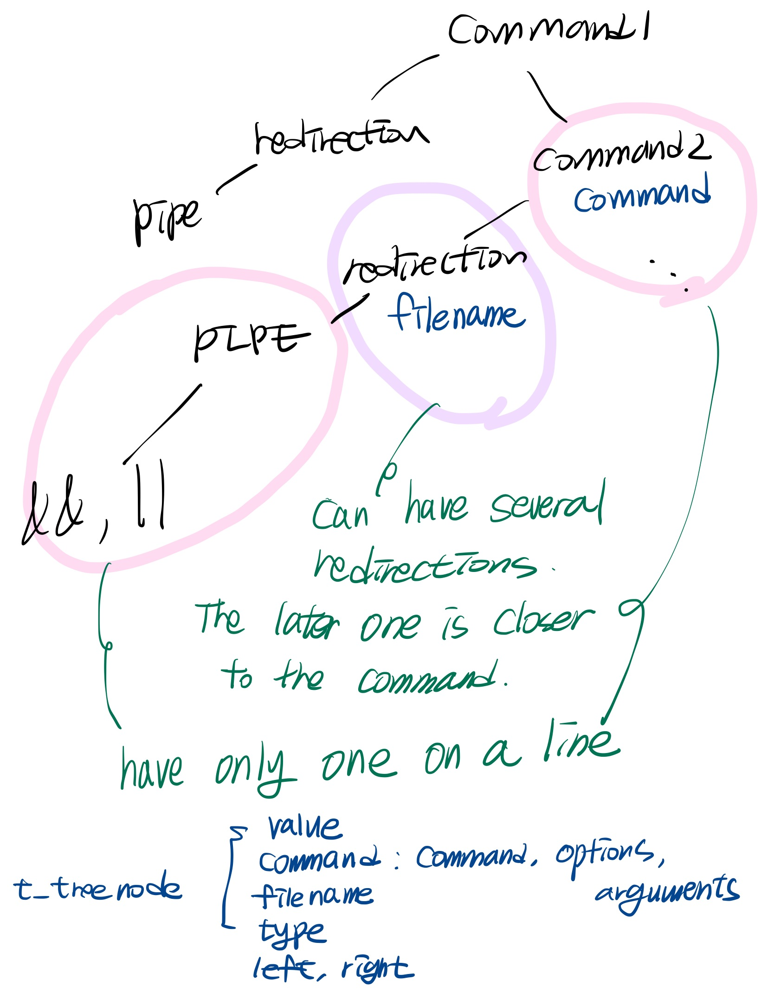

# Create a shell. It's small but still powerful 

### reference  

[GNU Bash Manual][bash]  
[Posix shell][posix]  
[Shell Grammar Rules][shell]  
[Base Definitions][base]  
[LL parser][ll]  
[Chomsky hierarchy][chom]

[bash]: https://www.gnu.org/software/bash/manual/bash.html
[posix]: https://pubs.opengroup.org/onlinepubs/9699919799/utilities/contents.html
[shell]: https://pubs.opengroup.org/onlinepubs/009604499/utilities/xcu_chap02.html#tag_02_10_02
[base]: https://pubs.opengroup.org/onlinepubs/9699919799.2018edition/
[ll]: https://en.wikipedia.org/wiki/LL_parser
[chom]: https://en.wikipedia.org/wiki/Chomsky_hierarchy


### External Functions  
<details>  
<summary>readline, printf, write, malloc, free </summary>
<div markdown="1">

### readline
Reads a line from the user input (stdin) and returns it as a dynamically allocated string. The user can edit the input line with various editing commands similar to those used in Unix command line environments.  
```c
#include <stdio.h>
#include <readline/readline.h>
#include <readline/history.h>

int main() {
    char *input = readline("Enter a string: ");
    printf("You entered: %s\n", input);
    free(input);
    return 0;
}
```

### rl_clear_history
Clears the entire history of input lines previously read by readline.  
```c
#include <readline/readline.h>
#include <readline/history.h>

void clear_history_and_exit() {
    rl_clear_history();
    exit(0);
}
```

### rl_on_new_line
Indicates that the cursor is on a new line, allowing readline to maintain proper screen output.
```c
#include <readline/readline.h>

void print_new_line() {
    rl_on_new_line();
    rl_redisplay();
}
```

### rl_replace_line
Replaces the current line buffer with a new string, without redisplaying the new line.   
```c
#include <readline/readline.h>

void replace_current_line(const char *new_line) {
    rl_replace_line(new_line, 0);
}
```

### rl_redisplay
Refreshes the display of the input line, useful after modifying the line buffer.   
```c
#include <readline/readline.h>

void refresh_display() {
    rl_redisplay();
}
```

### add_history
Adds the recently-read line to the input history, allowing the user to recall previous lines.   
```c
#include <readline/readline.h>
#include <readline/history.h>

void add_input_to_history(const char *input) {
    add_history(input);
}
```

### printf
Formats and prints a string to the stdout (standard output).   
```c
#include <stdio.h>

int main() {
    int age = 25;
    printf("I am %d years old.\n", age);
    return 0;
}
```

### write
Writes a specified number of bytes from a buffer to a file descriptor.   
```c
#include <unistd.h>
#include <fcntl.h>

int main() {
    int fd = open("test.txt", O_WRONLY | O_CREAT, 0644);
    if (fd == -1) {
        return 1;
    }

    const char *text = "Hello, World!";
    ssize_t bytes_written = write(fd, text, 13);

    close(fd);
    return 0;
}
```

### malloc & free
malloc allocates a specified size of memory in bytes and returns a pointer to the allocated memory. free deallocates previously allocated memory pointed to by the provided pointer.   
```c
#include <stdlib.h>

int main() {
    int *arr = (int *)malloc(5 * sizeof(int));
    if (!arr) {
        return 1;
    }

    for (int i = 0; i < 5; i++) {
        arr[i] = i;
    }

    for (int i = 0; i < 5; i++) {
        printf("%d ", arr[i]);
    }

    free(arr);
    return 0;
}
```

</div>
</details>

<details>
<summary>access, open, opendir, read </summary>
<div markdown="1">

### access
Checks the access permissions of a file based on the specified mode.   
```c
#include <unistd.h>
#include <stdio.h>

int main() {
    if (access("test.txt", R_OK) == 0) {
        printf("The file test.txt is readable.\n");
    } else {
        printf("The file test.txt is not readable.\n");
    }
    return 0;
}
```

### open & close
open() opens a file with specified flags and mode, returning a file descriptor. close() closes a file descriptor, freeing up system resources.   
```c
#include <fcntl.h>
#include <unistd.h>

int main() {
    int fd = open("test.txt", O_RDONLY);
    if (fd == -1) {
        return 1;
    }

    // Do something with the file descriptor here.

    close(fd);
    return 0;
}
```

### opendir, readdir, closedir
opendir opens a directory stream, readdir reads entries from the directory stream, and closedir closes the directory stream.   
```c
#include <dirent.h>
#include <stdio.h>

int main() {
    DIR *dir = opendir(".");
    if (dir == NULL) {
        perror("Failed to open directory");
        return 1;
    }

    struct dirent *entry;
    while ((entry = readdir(dir)) != NULL) {
        printf("Found file: %s\n", entry->d_name);
    }

    closedir(dir);
    return 0;
}
```

### read
Reads a specified number of bytes from a file descriptor into a buffer.   
```c
#include <fcntl.h>
#include <unistd.h>
#include <stdio.h>

int main() {
    int fd = open("test.txt", O_RDONLY);
    if (fd == -1) {
        return 1;
    }

    char buffer[256];
    ssize_t bytes_read = read(fd, buffer, sizeof(buffer) - 1);
    buffer[bytes_read] = '\0';

    printf("Content: %s\n", buffer);

    close(fd);
    return 0;
}
```
</div>
</details>


<details>
<summary>fork, wait, waitpid, execve, dup, pipe </summary>
<div markdown="1">

### fork
Creates a new process by duplicating the calling process, resulting in a parent and child process with separate memory spaces.
```c
#include <unistd.h>
#include <stdio.h>

int main() {
    pid_t pid = fork();

    if (pid == 0) {
        printf("I am the child process with pid %d.\n", getpid());
    } else {
        printf("I am the parent process with pid %d.\n", getpid());
    }
    return 0;
}
```

### wait
Suspends the calling process until one of its child processes terminates, returning the child's process ID and exit status.
```c
#include <sys/wait.h>
#include <unistd.h>
#include <stdio.h>

int main() {
    pid_t pid = fork();

    if (pid == 0) {
        // Child process
        sleep(2);
        return 42;
    } else {
        // Parent process
        int status;
        wait(&status);
        printf("Child exited with status %d.\n", WEXITSTATUS(status));
    }
    return 0;
}
```

### waitpid
Similar to wait, but allows the calling process to wait for a specific child process or any child process that matches the specified process ID.   
```c
#include <sys/wait.h>
#include <unistd.h>
#include <stdio.h>

int main() {
    pid_t pid = fork();

    if (pid == 0) {
        // Child process
        sleep(2);
        return 42;
    } else {
        // Parent process
        int status;
        waitpid(pid, &status, 0);
        printf("Child exited with status %d.\n", WEXITSTATUS(status));
    }
    return 0;
}
```

### wait3 & wait4
These functions are similar to wait and waitpid but also return resource usage information about the child process in a struct rusage parameter.
```c
#include <sys/wait.h>
#include <sys/resource.h>
#include <unistd.h>
#include <stdio.h>

int main() {
    pid_t pid = fork();

    if (pid == 0) {
        // Child process
        sleep(2);
        return 42;
    } else {
        // Parent process
        int status;
        struct rusage usage;
        wait3(&status, 0, &usage); // Use wait4(pid, &status, 0, &usage) to wait for a specific pid
        printf("Child exited with status %d.\n", WEXITSTATUS(status));
    }
    return 0;
}
```

### execve
Replaces the current process image with a new process image specified by the given file. The new process starts executing at its main() function.
```c
#include <unistd.h>
#include <stdio.h>

int main() {
    char *argv[] = { "ls", "-l", NULL };
    char *envp[] = { NULL };

    if (execve("/bin/ls", argv, envp) == -1) {
        perror("Failed to execute ls");
    }
    return 0;
}
```

### dup & dup2
dup creates a new file descriptor that is a duplicate of the specified file descriptor, whereas dup2 duplicates a file descriptor to a specified file descriptor.   
```c
#include <fcntl.h>
#include <unistd.h>

int main() {
    int fd = open("test.txt", O_RDONLY);
    int new_fd = dup(fd);
    // new_fd now refers to the same file as fd.

    int another_fd = open("another.txt", O_RDONLY);
    dup2(fd, another_fd);
    // another_fd now refers to the same file as fd, and the previous file is closed.

    close(fd);
    close(new_fd);
    close(another_fd);
    return 0;
}
```

### pipe
Creates a unidirectional pipe, with one end for reading and the other for writing.   
```c
#include <unistd.h>
#include <stdio.h>

int main() {
    int pipefd[2];
    if (pipe(pipefd) == -1) {
        perror("Failed to create pipe");
        return 1;
    }

    pid_t pid = fork();

    if (pid == 0) {
        // Child process
        close(pipefd[0]); // Close read end
        write(pipefd[1], "Hello from child!", 17);
        close(pipefd[1]);
    } else {
        // Parent process
        close(pipefd[1]); // Close write end
        char buffer[256];
        ssize_t bytes_read = read(pipefd[0], buffer, sizeof(buffer) - 1);
        buffer[bytes_read] = '\0';
        printf("Received from child: %s\n", buffer);
        close(pipefd[0]);
    }
    return 0;
}
```
</div>
</details>


<details>
<summary>signal, kill</summary>
<div markdown="1">

### signal
Sets a function to handle a specific signal. When the signal is received, the specified handler function is called.   
```c
#include <signal.h>
#include <stdio.h>
#include <unistd.h>

void handle_signal(int sig) {
    printf("Signal %d received.\n", sig);
}

int main() {
    signal(SIGINT, handle_signal);

    while (1) {
        sleep(1);
    }
    return 0;
}
```

### sigaction
Similar to signal, but provides more control over the signal handling process. Allows for specifying additional signal handling options and obtaining the previous signal handler.  
```c
#include <signal.h>
#include <stdio.h>
#include <unistd.h>

void handle_signal(int sig) {
    printf("Signal %d received.\n", sig);
}

int main() {
    struct sigaction action;
    action.sa_handler = handle_signal;
    sigemptyset(&action.sa_mask);
    action.sa_flags = 0;

    sigaction(SIGINT, &action, NULL);

    while (1) {
        sleep(1);
    }
    return 0;
}
```

### sigemptyset & sigaddset
sigemptyset initializes a signal set to be empty. sigaddset adds a specific signal to a signal set.   
```c
#include <signal.h>

int main() {
    sigset_t set;
    sigemptyset(&set);
    sigaddset(&set, SIGINT);
    // Use the signal set with other signal-related functions
    return 0;
}
```

### kill
Sends a specific signal to a process or a group of processes.   
```c
#include <signal.h>
#include <unistd.h>
#include <stdio.h>

int main() {
    pid_t pid = fork();

    if (pid == 0) {
        // Child process
        printf("Child process started with pid %d.\n", getpid());
        while (1) {
            sleep(1);
        }
    } else {
        // Parent process
        sleep(3);
        printf("Killing child process with pid %d.\n", pid);
        kill(pid, SIGTERM);
    }
    return 0;
}
```

</div>
</details>


<details>
<summary>exit, strerror & perror </summary>
<div markdown="1">

### exit
Terminates the calling process and returns the specified exit status.   
```c
#include <stdlib.h>
#include <stdio.h>

int main() {
    printf("Exiting with status 0.\n");
    exit(0);
}
```

### strerror & perror
strerror returns a string describing an error number, and perror prints a string describing the last error encountered.   
```c
#include <errno.h>
#include <string.h>
#include <stdio.h>

int main() {
    FILE *file = fopen("nonexistent.txt", "r");
    if (file == NULL) {
        printf("Error: %s\n", strerror(errno));
        perror("Failed to open nonexistent.txt");
    }
    return 0;
}
```

</div>
</details>


<details>
<summary>getcwd, chdir, stat, unlink </summary>
<div markdown="1">

### getcwd
Gets the current working directory and stores it in the provided buffer.
```c
#include <unistd.h>
#include <stdio.h>

int main() {
    char buffer[256];
    if (getcwd(buffer, sizeof(buffer)) != NULL) {
        printf("Current working directory: %s\n", buffer);
    }
    return 0;
}
```

### chdir
Changes the current working directory of the calling process to the specified path.   
```c
#include <unistd.h>
#include <stdio.h>

int main() {
    if (chdir("/tmp") == 0) {
        printf("Changed working directory to /tmp.\n");
    } else {
        perror("Failed to change working directory");
    }
    return 0;
}
```

### stat, lstat, fstat
These functions obtain information about a file. stat() and lstat() take a file path as an argument, while fstat() takes a file descriptor. lstat() is similar to stat() but does not follow symbolic links.   
```c
#include <sys/types.h>
#include <sys/stat.h>
#include <unistd.h>
#include <stdio.h>

int main() {
    struct stat file_info;
    if (stat("test.txt", &file_info) == 0) {
        printf("Size of test.txt: %ld bytes\n", file_info.st_size);
    } else {
        perror("Failed to get file information");
    }
    return 0;
}
```

### unlink
Deletes a specified file by removing its link from the file system.   
```c
#include <unistd.h>
#include <stdio.h>

int main() {
    if (unlink("test.txt") == 0) {
        printf("Successfully deleted test.txt.\n");
    } else {
        perror("Failed to delete test.txt");
    }
    return 0;
}
```
</div>
</details>


<details>
<summary>isatty, ttyname, ttyslot, ioctl, getenv, tcsetattr </summary>
<div markdown="1">


### isatty
Checks if a given file descriptor is associated with a terminal device.   
```c
#include <unistd.h>
#include <stdio.h>

int main() {
    if (isatty(STDOUT_FILENO)) {
        printf("stdout is a terminal.\n");
    } else {
        printf("stdout is not a terminal.\n");
    }
    return 0;
}
```

### ttyname
Returns a pointer to a string containing the name of the terminal device associated with a given file descriptor.   
```c
#include <unistd.h>
#include <stdio.h>

int main() {
    char *name = ttyname(STDIN_FILENO);
    if (name) {
        printf("Terminal name: %s\n", name);
    } else {
        printf("Not a terminal.\n");
    }
    return 0;
}
```

### ttyslot
Returns the index of the terminal device associated with the calling process's standard input in the system's terminal table (utmp file).   
```c
#include <unistd.h>
#include <stdio.h>

int main() {
    int slot = ttyslot();
    if (slot > 0) {
        printf("Terminal slot: %d\n", slot);
    } else {
        printf("Not a terminal.\n");
    }
    return 0;
}
```

### ioctl
Performs various control operations on a file descriptor.   
```c
#include <sys/ioctl.h>
#include <unistd.h>
#include <stdio.h>

int main() {
    struct winsize ws;
    if (ioctl(STDOUT_FILENO, TIOCGWINSZ, &ws) == 0) {
        printf("Terminal size: %d rows, %d columns\n", ws.ws_row, ws.ws_col);
    } else {
        perror("Failed to get terminal size");
    }
    return 0;
}
```

### getenv
Returns the value of an environment variable as a string.   
```c
#include <stdlib.h>
#include <stdio.h>

int main() {
    char *path = getenv("PATH");
    if (path) {
        printf("PATH: %s\n", path);
    } else {
        printf("PATH not found.\n");
    }
    return 0;
}
```

### tcsetattr & tcgetattr
tcsetattr sets the terminal attributes for a file descriptor, and tcgetattr gets the terminal attributes for a file descriptor.   
```c
#include <termios.h>
#include <unistd.h>
#include <stdio.h>

int main() {
    struct termios term;
    if (tcgetattr(STDIN_FILENO, &term) == 0) {
        printf("Terminal attributes retrieved.\n");

        term.c_lflag &= ~ECHO; // Turn off echoing

        if (tcsetattr(STDIN_FILENO, TCSANOW, &term) == 0) {
            printf("Terminal attributes set.\n");
        } else {
            perror("Failed to set terminal attributes");
        }
    } else {
        perror("Failed to get terminal attributes");
    }
    return 0;
}
```
</div>
</details>


<details>
<summary>tgetent, tgetflag, tgetnum, tgetstr, tgoto, tputs </summary>
<div markdown="1">

### tgetent
Loads the termcap entry for a terminal into a provided buffer.   
```c
#include <term.h>
#include <stdio.h>

int main() {
    char term_buffer[1024];
    if (tgetent(term_buffer, getenv("TERM")) == 1) {
        printf("Termcap entry loaded.\n");
    } else {
        printf("Failed to load termcap entry.\n");
    }
    return 0;
}
```

### tgetflag
Gets the value of a boolean capability from the termcap entry.   
```c
#include <term.h>
#include <stdio.h>

int main() {
    char term_buffer[1024];
    tgetent(term_buffer, getenv("TERM"));

    int has_am = tgetflag("am");
    printf("Auto-margins: %s\n", has_am ? "Yes" : "No");
    return 0;
}
```

### tgetnum
Gets the value of a numeric capability from the termcap entry.   
```c
#include <term.h>
#include <stdio.h>

int main() {
    char term_buffer[1024];
    tgetent(term_buffer, getenv("TERM"));

    int columns = tgetnum("co");
    printf("Columns: %d\n", columns);
    return 0;
}
```

### tgetstr
Gets the value of a string capability from the termcap entry.   
```c
#include <term.h>
#include <stdio.h>

int main() {
    char term_buffer[1024];
    char cap_buffer[256];
    tgetent(term_buffer, getenv("TERM"));

    char *clear_screen = tgetstr("cl", &cap_buffer);
    if (clear_screen) {
        tputs(clear_screen, 1, putchar);
    } else {
        printf("Failed to get clear screen capability.\n");
    }
    return 0;
}
```

### tgoto
Generates a cursor addressing string with specified row and column values.   
```c
#include <term.h>
#include <stdio.h>

int main() {
    char term_buffer[1024];
    tgetent(term_buffer, getenv("TERM"));

    char *cursor_address = tgetstr("cm", NULL);
    if (cursor_address) {
        char *move_cursor = tgoto(cursor_address, 10, 5);
        tputs(move_cursor, 1, putchar);
        printf("X");
    } else {
        printf("Failed to get cursor movement capability.\n");
    }
    return 0;
}
```

### tputs
Outputs a string capability, applying necessary padding.   
```c
#include <term.h>
#include <stdio.h>

int main() {
    char term_buffer[1024];
    tgetent(term_buffer, getenv("TERM"));

    char cap_buffer[256];

    // Get the string capability to enable underline
    char *underline_on = tgetstr("us", &cap_buffer);
    if (underline_on) {
        // Output the capability using tputs
        tputs(underline_on, 1, putchar);
        printf("Underlined text");

        // Get the string capability to disable underline
        char *underline_off = tgetstr("ue", &cap_buffer);
        if (underline_off) {
            // Output the capability using tputs
            tputs(underline_off, 1, putchar);
            printf("\nNormal text");
        }
    } else {
        printf("Failed to get underline capability.\n");
    }
    return 0;
}
```

</div>
</details>

### Setting
<details>
<summary>Setting</summary>
<div markdown="1">

**install brew**  
```
rm -rf $HOME/.brew && git clone --depth=1 https://github.com/Homebrew/brew $HOME/.brew && export PATH=$HOME/.brew/bin:$PATH && brew update && echo "export PATH=$HOME/.brew/bin:$PATH" >> ~/.zshrc
```

**install readline**  
```
brew install readline && mkdir $HOME/.brew && curl -fsSLhttps://github.com/Homebrew/brew/tarball/master | tar xz --strip 1 -C $HOME/.brew
mkdir -p /tmp/.$(whoami)-brew-locks
mkdir -p $HOME/.brew/var/homebrew
ln -s /tmp/.$(whoami)-brew-locks $HOME/.brew/var/homebrew/locks
export PATH="$HOME/.brew/bin:$PATH"
```

**upgrade brew**
```
brew update && brew upgrade
```

**upgrade bash**
```
brew install bash
```

</div>
<<<<<<< HEAD
</details>  


## built_in
<details>
<summary>what is built_in?</summary>
<div markdown="1">
Ecole42's Minishell program includes several built-in commands that are implemented within the shell itself, rather than being separate external programs.

**Here is a list of the built-in commands in Ecole42's Minishell:**

- **echo: Displays a message on the terminal.**
- **cd: Changes the current working directory.**
- **pwd: Prints the current working directory.**
- **export: Sets the value of an environment variable.**
- **unset: Removes an environment variable.**
- **env: Prints a list of environment variables.**
- **exit: Exits the shell.**

These built-in commands are executed directly by the shell, which makes them faster and more efficient than external commands. 

Additionally, the shell can provide more functionality and customization for built-in commands since they are a part of the shell itself.
</div>
</details>

<details>
<summary>echo</summary>
<div markdown="1">
Features : Outputs a string or variable.  

options : -n (Do not print newlines)
```c
$ echo -n "Hello"
Hello$
```
Edge cases  
1. -n options
```c
$ echo -nnnnnnnn Hello
Hello$
$ echo -n -n -n -n -nnn -nnnn -nnnnm Hello
Hello$
$ echo -n -n -n -n -nnn -nnnn -nnnnm -nHello
-nHello$
```
2. When using echo with $Key echo printed "Value”
```c
bash-5.2$ export a=1000
bash-5.2$ export
declare -x a="1000"
bash-5.2$ echo a
a
bash-5.2$ echo $a
1000
```
</div>
</details>

<details>
<summary>cd</summary>
<div markdown="1">
Features : Move directory  

examples :  

```c
move to specified directory (relative path)
$ cd directory_path
$ cd ./A/B/C
$ cd /A/B/C

move to parent diretory
$ cd ..

move to before directory
$ cd -
```

edge case :

1. If you find "PWD" when you try to use the "env" or "export" command, then "PWD" must be updated.  

```c
export | grep "PWD"

declare -x OLDPWD="/Users/hyojocho/Desktop/MINISHELL"
declare -x PWD="/Users/hyojocho"
```
2. After trying the "unset HOME" command, when you try cd, your shell must output "bash: cd: HOME not set".

```c
bash-5.2$ unset HOME
bash-5.2$ cd
bash: cd: HOME not set
```

3. If you delete the parent directory and try to access the parent directory, you get the following error: "cd: error retrieving current directory: getcwd: cannot access parent directories: No such file or directory".

```c
If you delete the parent directory and try to access the parent directory, you get the following error: "cd: error retrieving current directory: getcwd: cannot access parent directories: No such file or directory".
```
</div>
</details>

<details>
<summary>pwd</summary>
<div markdown="1">
In shell scripting, **`pwd`** stands for "print working directory". The **`pwd`** command is used to display the current working directory, which is the directory in which the user is currently located.

Here is the basic syntax of the **`pwd`** command:
```c
pwd
```
When you type this command in the shell, it will display the current working directory in the terminal. For example, if you are currently located in the /home/user/Documents
directory, then the pwd command will display the following output:
```c
/home/user/Documents
```
The pwd command is useful for navigating the file system and understanding your current location in the directory structure. You can use the output of the pwd
command to create file paths, change directories, and perform other file-related operations.

</div>
</details>

<details>
<summary>export</summary>
<div markdown="1">
the **`export`**command is used to set an environment variable that can be accessed by any child process of the shell.

Here is the basic syntax of the **`export`** command:
```c
export VARNAME=value
```
edge cases
1. "Export" can be used to add multiple values.
```c
bash-5.2$ export a b c d
bash-5.2$ export
declare -x a
declare -x b
declare -x c
declare -x d
bash-5.2$ export a=1 b=2 c=3 d=4
bash-5.2$ export
declare -x a="1"
declare -x b="2"
declare -x c="3"
declare -x d="4"
```
2. "Export" can’t get first character as Number or Special characters (Exclude '_’)
```c
bash-5.2$ export 1a
bash: export: `1a': not a valid identifier

bash-5.2$ export _a
bash-5.2$ export
declare -x _a

bash-5.2$ export a1
bash-5.2$ export
declare -x a1

bash-5.2$ export (1
bash: syntax error near unexpected token 1
```
3. If the key and value have already been exported, you can't use "Export" with the key only.
```c
bash-5.2$ export a=b
bash-5.2$ export
declare -x a="b"

bash-5.2$ export a
bash-5.2$ export
declare -x a="b"
```
4. Even if there are no valid identifiers, another validation key must be added.
```c
bash-5.2$ export a b c 1d
bash: export: '1d': not a valid identifier
bash-5.2$ export
declare -x a
declare -x b
declare -x c

bash-5.2$ export 1 a b c 
bash: export: '1': not a valid identifier
bash-5.2$ export
declare -x a
declare -x b
declare -x c
```
</div>
</details>

<details>
<summary>unset</summary>
<div markdown="1">
The **`unset`** command is a shell command in Unix and Unix-like operating systems that is used to unset or remove environment variables or shell functions.

When an environment variable is unset, it means that its value is removed from the current shell's environment, and any child processes will not inherit the variable.

Here's the syntax for the **`unset`**command:
```c
unset MY_VAR
```
This will remove the value of the MY_VAR variable from the current shell's environment.

edge cases
1. "Unset" can be used to remove multiple values.
```c
bash-5.2$ export a b c d e
bash-5.2$ export
declare -x a
declare -x b
declare -x c
declare -x d
declare -x e

bash-5.2$ unset a c e
bash-5.2$ export
declare -x b
declare -x d
```
2. "Unset" can erase when only “key” value received
```c
bash-5.2$ export a=1 b=2 c=3

case 1)
bash-5.2$ unset a=1 b=2 c=3
bash-5.2$ env
c=3
HOME=/Users/hyojocho
b=2
a=1

case 2)
bash-5.2$ unset a b c
bash-5.2$ env
-disappeared-
```
</div>
</details>

<details>
<summary>env</summary>
<div markdown="1">
The **`env`** command is a shell command in Unix and Unix-like operating systems that is used to display or modify the environment variables for the current shell and its child processes.

When used without any arguments, the **`env`** command displays a list of environment variables and their values. 

For example, you can type **`env`** in the terminal to see a list of all the environment variables that are currently set in your shell.

Here's the basic syntax for the **`env`** command:
```c
env
```
result is 
```c
PATH=/Users/hyojocho/.brew/bin:/Applications/Visual Studio Code.app/Contents/Resources/app/bin:/usr/local/bin:/usr/bin:/bin:/usr/sbin:/sbin:/usr/local/munki
LC_TERMINAL=iTerm2
COLORTERM=truecolor
COMMAND_MODE=unix2003
TERM=xterm-256color
HOME=/Users/hyojocho
TMPDIR=/var/folders/zz/zyxvpxvq6csfxvn_n000cv000036r0/T/
USER=hyojocho
XPC_SERVICE_NAME=0
LOGNAME=hyojocho
LaunchInstanceID=CB4EAA94-A6EC-48B1-B223-767DDF0F904E
__CF_USER_TEXT_ENCODING=0x0:0:0
ITERM_SESSION_ID=w0t0p0:8AE6874A-34C5-4D71-9709-9DEA32BE7D3F
SHLVL=1
OLDPWD=/Users/hyojocho
ZSH=/Users/hyojocho/.oh-my-zsh
PAGER=less
LESS=-R
LSCOLORS=Gxfxcxdxbxegedabagacad
LS_COLORS=di=1;36:ln=35:so=32:pi=33:ex=31:bd=34;46:cd=34;43:su=30;41:sg=30;46:tw=30;42:ow=30;43
```
</div>
</details>

<details>
<summary>exit</summary>
<div markdown="1">
The **`exit`** command is a shell command in Unix and Unix-like operating systems that is used to exit the current shell or shell script.

When you run the **`exit`** command, it terminates the current shell session and returns control to the parent process (usually the terminal emulator). Any commands or scripts that were running in the shell are terminated immediately.

Here's the basic syntax for the **`exit`** command:
```c
exit [n]
```
</div>
</details>
=======
</details>

 
Making a simple shell consists of the following steps.  

(1) Receive commands from the terminal using readline().  
(2) Lexical analysis: The received commands are split into token units and semanticised.  
(3) Syntax analysis: Receives tokens, checks them for grammatical correctness and parses them into a syntax tree.  
(4) Execution: Executes the command by traversing the syntax tree.  

Let's have a look at the syntax analysis, which is the core of minishell parsing.   
First of all, the structure of the tree is as follows.  


On the diagonal in the upper right-hand corner, from left to right, are an AND or OR, a pipe, a redirect, and a command.  
AND or OR, pipe, and command can only appear once on a line, but redirects can appear multiple times.  
Redirection which is parsed later is stacked closer to the command.  

The structure was created to store value, command, filename, type, left, right and heredoc count.  

```c
typedef struct tree_node
{
	char				*value;
	char				**command;
	char				*filename;
	int					type;
	struct tree_node	*left;
	struct tree_node	*right;
}						t_tree_node;

typedef struct binarytree
{
	t_tree_node			*root;
	int					heredoc_count;
	int					syntex_error;
}						t_binarytree;
```

All non-filename words are stored in a two-dimensional array, command. The very first value of command (command[0]) is identified as the command, the immediately following -word is identified as options, and the remaining values are identified as arguments. The advantage of storing this in a two-dimensional array is that it clarifies the tree. Also, when we use the execve function in the execution part, we can drop it in as an argument without much thought.  

```c
 int execve(const char *path, char *const argv[], char *const envp[]);
```

The redirections (<, >, <<, >>) always have a filename, and we've made it possible to store this value in a structure. My first thought was that we could store the filename to the right of the redirection. But then we'd have to think twice about whether the value was a command or a filename when parsing other tokens and looking for the rightmost node in the tree. For example, let's parse the command '<', 'a' ,'pwd'. Immediately before parsing pwd, the tree has '<' at the root and an 'a' at the root's right child. So if we were looking for the rightmost node with pwd, we would have to go through an extra step to distinguish the type. Because both filename or command have the same type - WORD. After parsing, we could have replaced type with FILENAME or COMMAND, but storing in a structure would be more convenient.  

### parse command
```c
void	parse_command_and_option(t_binarytree *tree, t_token *tokens,
		int *index)
{
	t_tree_node	*command_node;

	command_node = create_new_node(tokens[*index].value, tokens[*index].type);
	add_command_to_the_tree(tree, command_node);
	while (tokens[*index].type == WORD || tokens[*index].type == BUILTIN)
	{
		fill_command_structure(tree, tokens[*index].value);
		(*index)++;
	}
}
```
add_command_to_the_tree is a function that adds the node itself, and fil_command_structure is a function that puts the token value into the command of the structure.  

```c
void	add_command_to_the_tree(t_binarytree *tree, t_tree_node *command_node)
{
	t_tree_node	*current;
	t_tree_node	*previous;

	if (tree->root == NULL)
	{
		tree->root = command_node;
		return ;
	}
	else
	{
		current = tree->root;
		previous = NULL;
		while (current->right)
		{
			previous = current;
			current = current->right;
		}
		connect_command_node_to_tree(tree, current, previous, command_node);
	}
}
```
If the root of the tree is empty, it immediately inserts the command node. Otherwise it looks for the rightmost node (current) and the second from the right (previous). connect_command_node_to_tree parses 'current', 'previous' and 'command_node' into the tree.  

```c
static void	connect_command_node_to_tree(t_binarytree *tree, \
	t_tree_node *current, t_tree_node *previous, t_tree_node *command_node)
{
	if (find_pipe(current) == TRUE)
	{
		current->right = command_node;
		return ;
	}
	if ((current->type == WORD || current->type == BUILTIN))
	{
		free(command_node);
		return ;
	}
	command_node->left = current;
	if (previous)
	{
		previous->right = command_node;
	}
	else
	{
		tree->root = command_node;
	}
}

```
1. If there is a pipe, place a new command node on the right-hand side of the tree.  
2. if there is already a command node on the rightmost line of the tree, release the command node you just created and exit the function.  
3. If the situation is not (1) and (2), the command node will replace current, and current will be the left child of the command node because current means redirection or AND, OR.  

```c
static char	**get_new_command(t_tree_node *command_node, \
	char *value, size_t size)
{
	char	**new_command;

	new_command = ft_calloc(size + 2, sizeof(char *));
	ft_memmove(new_command, command_node->command, size * sizeof(char *));
	new_command[size] = value;
	new_command[size + 1] = NULL;
	return (new_command);
}

void	fill_command_structure(t_binarytree *tree, char *value)
{
	char		**new_command;
	t_tree_node	*command_node;
	size_t		size;

	command_node = find_rightmost_node(tree->root);
	if (command_node->command == NULL)
	{
		command_node->command = (char **)ft_calloc(2, sizeof(char *));
		command_node->command[0] = value;
		command_node->command[1] = NULL;
	}
	else
	{
		size = get_command_size(command_node);
		new_command = get_new_command(command_node, value, size);
		free(command_node->command);
		command_node->command = new_command;
	}
}
```
The structure is allocated an array that can hold a char * for the command variable, and we put value into it in the form of a flat copy. We've made it possible to reference value because it won't change afterward, rather than using strdup and allocating new memory.  

### parse redirection
```c
void	parse_redirection(t_binarytree *tree, t_token *tokens, int *index)
{
	int			type;
	char		*redirection;
	t_tree_node	*new_node;

	type = tokens[*index].type;
	redirection = tokens[*index].value;
	if (is_redirection(type) == 0)
		return ;
	new_node = create_new_node(redirection, type);
	if (new_node->type == HEREDOC)
		tree->heredoc_count++;
	redirection_to_tree(tree, new_node);
	(*index)++;
	if (tokens[*index].type == WORD)
		parse_filename(new_node, tokens[*index].value, index);
	else
	{
		printf("Error: Missing filename after '%s'\n", redirection);
		tree->syntex_error = TRUE;
	}
}
```

1. if heredoc, let heredoc count.  
2. redirection_to_tree: Parse the redirection node to the tree.  
3. parse_filename: Store the filename in the structure. If the filename does not exist, print an error message.  

```c
static void	connect_redirection_node(t_binarytree *tree, t_tree_node *current, \
		t_tree_node *previous, t_tree_node *new_node)
{
	if (find_pipe(current) == TRUE)
	{
		current->right = new_node;
		return ;
	}
	if ((current->type == WORD || current->type == BUILTIN))
	{
		new_node->left = current->left;
		current->left = new_node;
	}
	else
	{
		new_node->left = current;
		if (previous)
		{
			previous->right = new_node;
		}
		else
		{
			tree->root = new_node;
		}
	}
}
```
1. Find the rightmost node (current) and the second from the right (previous), as you did when parsing the command, and place new_node in the tree.  
2. If a command node exists, new_node goes to the left of the current.  
3. The new node becomes the rightmost node if a pipe is on that line.   
4. Otherwise, the new node takes the place of the current, and the current goes into the left of the newnode.  

### parse pipe

```c
static void	pipe_to_the_tree(t_binarytree *tree, t_tree_node *pipe_node, \
		int *index)
{
	t_tree_node	*current;

	if (tree->root == NULL)
	{
		free(pipe_node);
		printf("Syntax error: unexpected pipe '|'\n");
		tree->syntex_error = TRUE;
		(*index)++;
		return ;
	}
	else
	{
		current = find_rightmost_node(tree->root);
		if (current->type == PIPE || current->type == AND || \
				current->type == OR)
		{
			free(pipe_node);
			printf("Syntax error: unexpected pipe '|'\n");
			tree->syntex_error = TRUE;
			(*index)++;
			return ;
		}
		connect_pipe_node_to_tree(tree, current, pipe_node);
	}
	(*index)++;
}
```
1. It returns a syntax error if the tree is empty or if the rightmost node (the current node) is of type pipe, and, or.   
2. Otherwise, the pipe node will be parsed as a tree.   

```c
static void	connect_pipe_node_to_tree(t_binarytree *tree, \
	t_tree_node *current, t_tree_node *pipe_node)
{
	if (find_pipe(current) == TRUE)
	{
		free(pipe_node);
		printf("Syntax error: unexpected pipe '|'\n");
		tree->syntex_error = TRUE;
		return ;
	}
	while (current->left && is_redirection(current->left->type))
	{
		current = current->left;
	}
	pipe_node->left = current->left;
	current->left = pipe_node;
}
```
1. If the rightmost node has a pipe, print an error message.  
2. If not, move left and find the end of the redirection.   
3. Place the pipe to the left of that node.  
>>>>>>> aef024004f2575b51c0174fbdbc07281a87e5fd4
